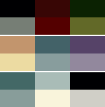

# Tengri's Colors
Color scheme to be used by Turkist people or just those who like this kind of color schemes.

## Colors

<table>
<tr><th>Dark Colors</th><th>Light Colors</th></tr>
<tr><td>
  
| Name | Color | Preview |
| ---- | ----- | ------- |
| Black | #010109 |  |
| Red | #3b0f0d |  |
| Green | #132709 |  |
| Yellow | #c1946d |  |
| Blue | #456268 |  |
| Purple | #574568 |  |
| Cyan | #456866 |  |
| White | #a7bbb6 |  |
| Foreground | #cfcec6 |  |
  
</td><td>
  
| Name | Color | Preview |
| ---- | ----- | ------- |
| Light Black | #757d74 |  |
| Light Red | #550502 |  |
| Light Green | #62692c |  |
| Light Yellow | #ebdaa1 |  |
| Light Blue | #879c9c |  |
| Light Purple | #91879c |  |
| Light Cyan | #879c99 |  |
| Light White | #f9f4da |  |
| Background | #00010a |  |
  
</td></tr> </table>

